# Проект "Анализ графика отпусков сотрудников"
(стек применяемых технологий: *Spring, Spring Boot, Spring Data JPA, Stream API, PostgreSQL, Thymeleaf, Hibernate, JUnit*)

**Задача:**

Необходимо проанализировать график отпусков структурного подразделения. Графики отпусков создаются по одному шаблону в файле формата Excel. Веб-приложение должно иметь возможность загружать данный файл, обрабатывать его содержимое и после выбора интересующих сотрудников анализировать его. ***Работа приложения протестирована с помощью JUnit***.

Функционал:
1) Страница с возможностью загрузить файл с графиком отпусков. При успешной загрузке файла появляется сообщение об этом.
2) Страция с возможностью добавления, удаления праздничных дней (влияют на дату окончания отпуска). Все праздничные дни записываются в базу данных.
3) Страница с возможностью выбрать сотрудников, которых необходимо сравнить (список сотрудников подгружается из файла с графиком).
4) Страница с возможностью посмотреть результат сравнения. Представляется информация по каждому сраниваемому сотруднику (с кем сравнивается, есть ли пересечения, если есть, то какие даты совпали).
5) Страница с возможностью посмотреть загруженную информацию (список сотрудников и их отпусков в удобном табличном виде).
6) Страница с образцом графика отпусков.
7) При загрузке невалидного файла и попытке получить из него информацию появляются предупреждающие сообщения.

## Изображения работы программы:
<u>**1. Стартовая страница**</u>

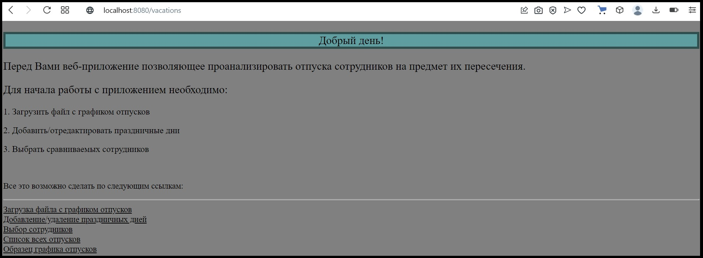

<u>**2. Загрузка файла**</u>

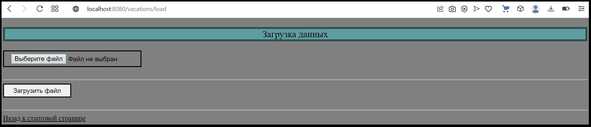

<u>**3. Результат успешной загрузки файла**</u>

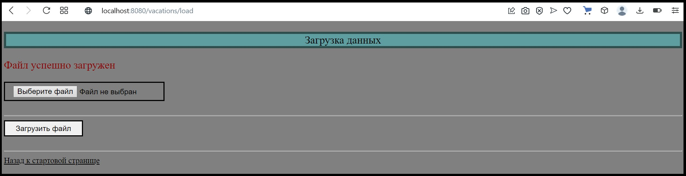

<u>**4. Попытка загрузить файл (файл не был выбран)**</u>

<u>**5. Добавление, удаление праздничных дней (применяется валидация полей)**</u>

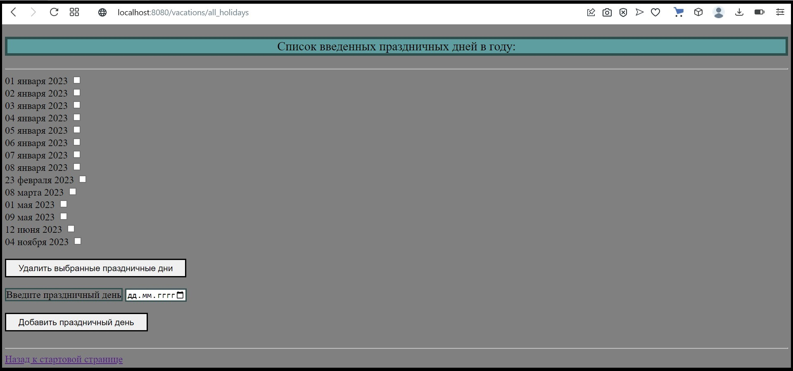

<u>**6. Добавление праздничных дней с помощью календаря**</u>

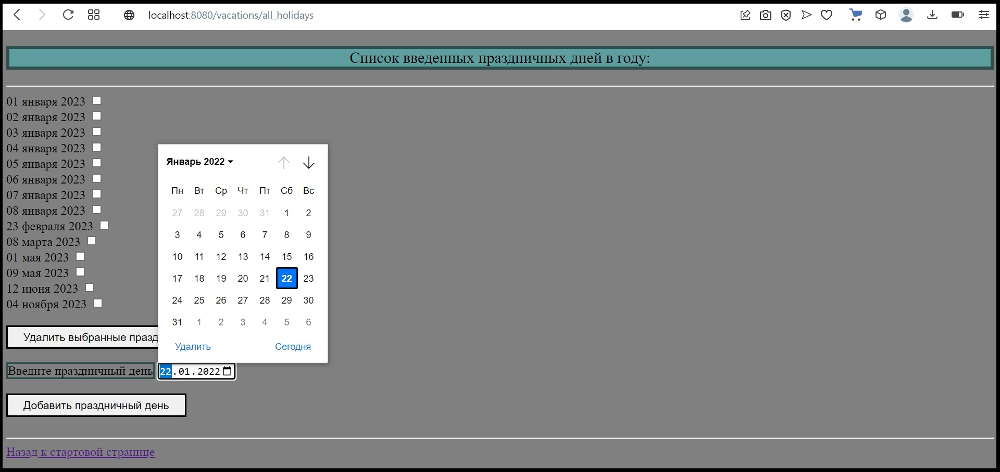

<u>**7. Выбор сотрудников для сравнения**</u>

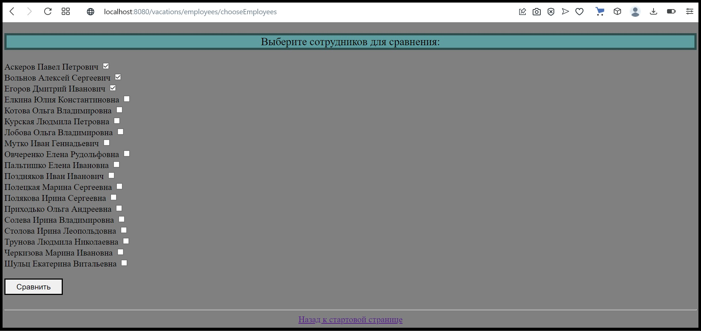

<u>**8. Результат сравнения**</u>

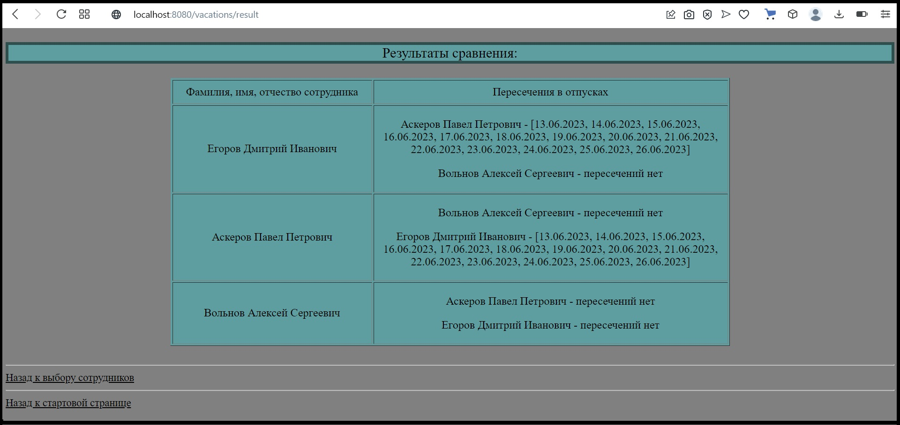

<u>**9. Загруженные отпуска сотрудников**</u>

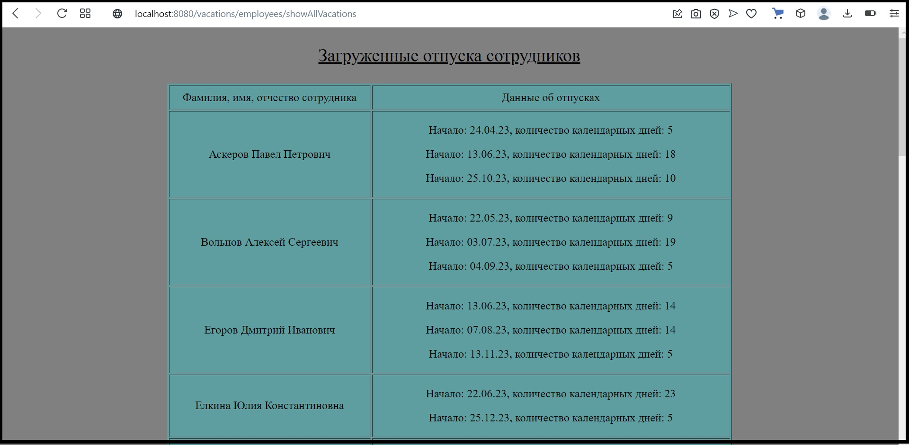

<u>**10. Образец графика отпусков**</u>

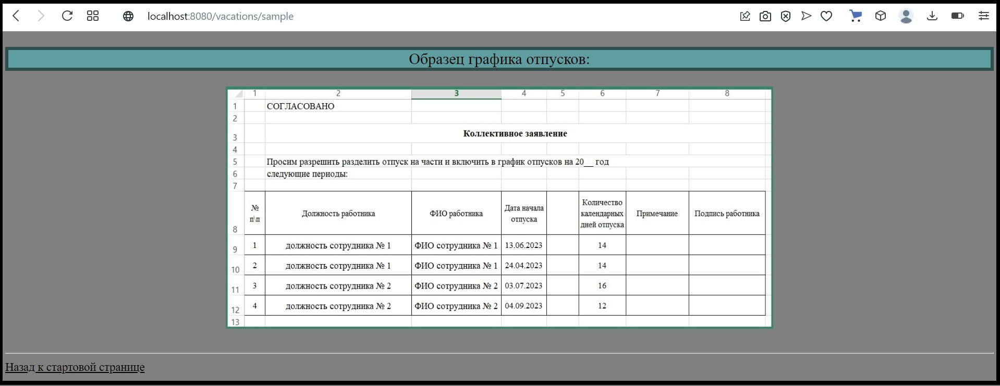

<u>**11. Попытка выбрать сотрудников для сравнения (файл невалидный, либо не загружен)**</u>

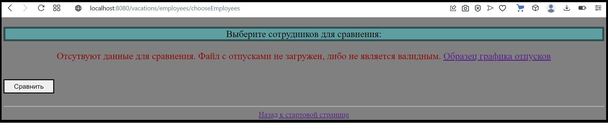

<u>**12. Попытка получить список загруженных отпусков (файл невалидный)**</u>

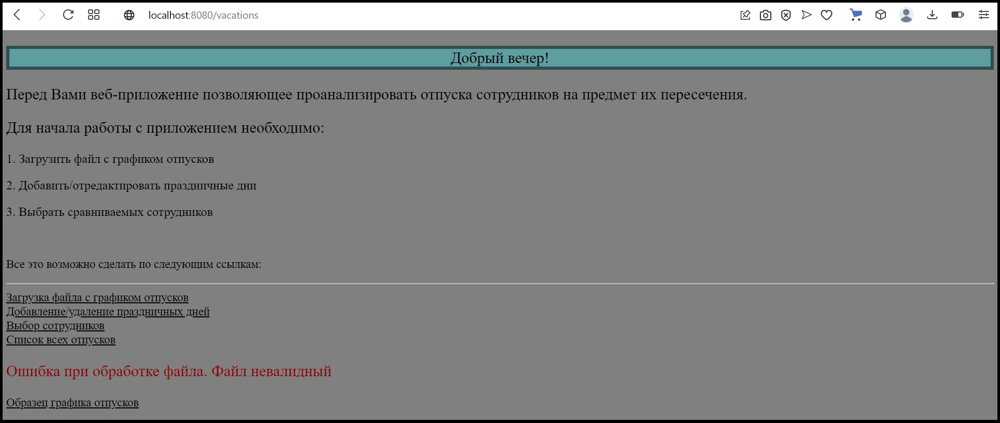